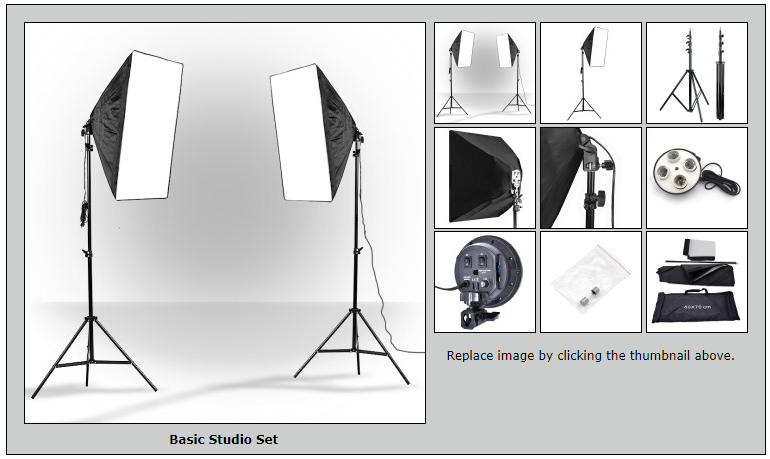

# Image Switch Without JavaScript

This application uses a mix of HTML and CSS to display images and thumbnails. When the
user clicks on a thumbnail, the image displayed changes accordingly. Each of the nine thumbnails
represents a product. This is what the application looks like:

*The image above is a snapshot of what the application looks like when a thumbnail is clicked on by the user.*

Live Demo: https://stellagurin.github.io/Image-Switch-Without-JavaScript/